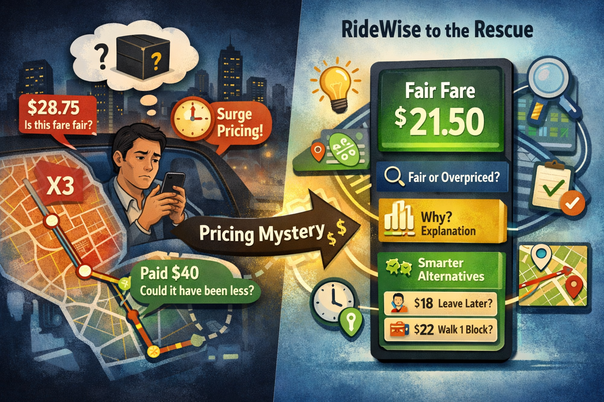

# RideWise: Graph-Based Predictive Modeling and Counterfactual Analysis for Fair CAB Ride Pricing
> *Built by Abhijnan Das | M.Sc. Statistics*

---

## 🎯 The Problem

Ride-hailing platforms like Uber use dynamic pricing algorithms that are largely a black box to the end user. A passenger has no way of knowing:

- **Is the fare I'm being charged actually fair?**
- **Why is this ride priced the way it is?**
- **Could I have paid less by leaving 30 minutes later, or walking one block over?**

This information asymmetry means passengers routinely overpay without ever realizing it. Surge pricing, peak-hour premiums, and route-based overcharging are invisible forces that silently inflate fares — and existing fare estimators only tell you *what* you'll pay, never *whether it's fair* or *what you could do about it*.

**RideWise solves this.** It is a decision intelligence system — not just a predictor — that estimates what a fair fare *should* be, detects when actual fares deviate from that expectation, explains *why*, and actively suggests smarter alternatives.



## 🎬 Demo ( Open in Laptop )
 
▶️ **[Watch Live Demo for streamlit](https://drive.google.com/file/d/1N4pR31oExw28lXBkJQ2uQ80moY_GQbtJ/view?usp=sharing)**
---

## 💡 What Makes This Different

Most fare prediction projects stop at "predict the fare." RideWise goes three steps further:

| Capability | Typical ML Project | RideWise |
|---|---|---|
| Fare prediction | ✅ | ✅ |
| Spatial graph modeling | ❌ | ✅ GNN over NYC zones |
| Fairness detection | ❌ | ✅ Deviation-based scoring |
| Explainability | ❌ | ✅ Feature perturbation |
| Counterfactual reasoning | ❌ | ✅ Time / location / pooling |
| Interactive product | ❌ | ✅ Streamlit app |

The use of **Graph Neural Networks** to model NYC as a spatial graph of zones — where node context (zone demand, avg fare) and edge features (distance, time, passengers) jointly predict fares — is the core architectural innovation. GNNs capture the relational structure of urban mobility that tabular models completely ignore.

---

## 🗺️ How It Works

### The Core Idea
NYC is divided into **100 spatial zones** using KMeans clustering on pickup/dropoff coordinates. Every Uber ride becomes an **edge** in a graph connecting two zones. The GNN learns zone-level context (how busy is this area? how expensive are rides from here?) and combines it with per-ride features (distance, time of day, passengers) to predict what a fair fare should be.

### Full Pipeline

```
Raw Data (200k+ NYC Uber rides)
        ↓
Data Cleaning & Validation
(remove invalid coords, fare outliers, zero-distance rides)
        ↓
Temporal Feature Engineering
(cyclical hour/day/month encoding, peak detection)
        ↓
Spatial Discretization
(KMeans → 100 zones, each ride = pickup_zone → dropoff_zone edge)
        ↓
Train / Val / Test Split  ← at ride level, BEFORE graph build
(prevents leakage of val/test fare info into node features)
        ↓
Graph Construction
(node features from train only: demand, avg fare, peak ratio, coords)
(edge features per ride: distance, passengers, time encoding)
        ↓
GNN Training — GraphSAGE + GAT Hybrid
(StandardScaler labels, Huber loss, AdamW + Cosine LR)
        ↓
Fairness Engine
(deviation = actual − predicted / predicted → Fair / Overpriced / Underpriced)
        ↓
Explainability Layer
(feature perturbation → % contribution of each factor)
        ↓
Counterfactual Engine
(simulate: different time, nearby pickup, ride pooling → $ savings)
        ↓
Streamlit App
```

---

## 🤖 Model Architecture — RideWiseGNN

A hybrid **GraphSAGE + GAT** network designed for edge-level fare prediction.

```
Node Features (12) → Linear → LayerNorm → GELU
        ↓
GraphSAGE Layer 1  (mean aggregation + residual)
        ↓
GraphSAGE Layer 2  (mean aggregation + residual)
        ↓
GAT Layer          (4 attention heads → learns which zones matter)
        ↓
Node Embeddings [N_zones × 64]

Edge Features (11) → Linear → LayerNorm → GELU → Linear
        ↓
Edge Embeddings [N_rides × 64]

[src_zone_emb | dst_zone_emb | edge_emb]  →  MLP Head  →  Fare ($)
```

**Why GraphSAGE + GAT?**
- GraphSAGE handles large graphs scalably via neighborhood sampling aggregation
- GAT adds learned attention weights so the model focuses on the most relevant neighboring zones — critical in NYC where Manhattan behaves very differently from outer boroughs
- Residual connections prevent gradient vanishing across layers

**Training details:**
- Loss: Huber (robust to outlier fares that survive cleaning)
- Optimizer: AdamW with weight decay
- Scheduler: Cosine annealing
- Gradient clipping: max norm 1.0
- Early stopping: patience 20 epochs

---

## 📊 Results

| Metric | Value |
|--------|-------|
| Test MAE | **$2.02** |
| Test RMSE | **$3.12** |
| R² Score | **0.889** |
| Training rides | 183,365 |
| Spatial zones | 100 |
| Fair routes | 61.0% |
| Overpriced routes | 16.5% |
| Fare Gini coefficient | 0.3547 |

The MAE of $2.02 means the model's "fair fare" estimate is within $2 of the actual average fare for a given route — strong enough to meaningfully flag overpricing.

---

## ⚖️ Fairness Engine

For each ride, the system computes:

```
deviation = (actual_fare − predicted_fare) / predicted_fare
```

| Label | Condition | Meaning |
|-------|-----------|---------|
| ✅ Fair | \|deviation\| ≤ 20% | Fare is within expected range |
| ⚠️ Overpriced | deviation > +20% | You're being charged significantly above fair value |
| 🔵 Underpriced | deviation < −20% | Fare is below expected — unusually cheap |

A **Fairness Score (0–100)** is also computed: `100 − |deviation| × 100`, giving a continuous measure of how close the fare is to the expected value.

---

## 🔄 Counterfactual Engine

The counterfactual engine answers: *"What would the fare have been if something were different?"*

It simulates three types of alternatives:

1. **Time shift** — travel 1–3 hours earlier/later to avoid rush hour
2. **Nearby pickup** — walk to an adjacent zone with historically cheaper fares
3. **Ride pooling** — estimated ~30% discount for shared rides

For each alternative, the GNN is re-queried with modified inputs, and potential savings are computed and ranked.

---

## 🔍 Explainability

Each prediction is explained via **feature perturbation**: each input feature is zeroed out one at a time, and the change in predicted fare measures that feature's contribution. Results are normalized to percentages and displayed as an importance ranking.

Typical top factors: Distance (dominant), Peak Hour effect, Time of Day encoding.

---

## 🖥️ Streamlit App Features

- **4 NYC quick presets** — JFK→Times Square, Times Sq→Brooklyn, Midtown→LGA, Wall St→Central Park
- **Custom coordinate input** — any pickup/dropoff within NYC
- **Fare block** — predicted fair fare, fairness badge, 0–100 score, deviation %
- **Explanation tab** — feature importance bar chart
- **Alternatives tab** — ranked counterfactual suggestions with estimated savings
- **Map tab** — your route overlaid on the zone-level fairness heatmap
- **Global analytics** — system-wide fairness distribution, deviation histogram, zone map

---

## 📁 Project Structure ( I have't uploaded the whole structure)

```
ridewise/
├── RideWise_v2_Fixed.ipynb        ← Kaggle training notebook
├── ridewise_streamlit/
│   ├── app.py                     ← Streamlit app
│   ├── requirements.txt
│   └── ridewise_artifacts/        
│       ├── best_model.pt          ← Trained GNN weights (707 KB)
│       ├── kmeans_zones.pkl       ← Spatial zone clusterer
│       ├── node_scaler.pkl        ← Node feature scaler
│       ├── edge_scaler.pkl        ← Edge feature scaler
│       ├── label_scaler.pkl       ← Fare label scaler
│       ├── model_config.json      ← Architecture config
│       ├── summary.json           ← Performance metrics
│       ├── node_feats_scaled.npy  ← Preprocessed node features
│       ├── edge_data.csv          ← Route-level aggregates
│       ├── fairness_results.csv   ← Per-ride fairness labels
│       ├── zone_centers.csv       ← Zone lat/lon centroids
│       └── zone_stats.csv         ← Zone-level fairness stats
└── README.md
```

---

## 📦 Dataset
 
- **Source**: [Uber Fares Dataset — Kaggle](https://www.kaggle.com/datasets/yasserh/uber-fares-dataset)
- **Coverage**: ~200,000 NYC Uber trips, 2009–2015
- **Features used**: pickup/dropoff coordinates, datetime, passenger count, fare amount
---

## 🛠️ Tech Stack

| Component | Technology |
|-----------|-----------|
| GNN Framework | PyTorch Geometric |
| Graph layers | GraphSAGE, GAT |
| Deep learning | PyTorch |
| Spatial clustering | Scikit-learn KMeans |
| App framework | Streamlit |
| Data processing | Pandas, NumPy |
| Visualization | Matplotlib |
| Model persistence | Joblib, PyTorch save |

---

## 👤 Author

**Abhijnan Das**  
M.Sc. Statistics  

---

*RideWise · Graph Neural Network · Fairness Detection · Counterfactual Intelligence*
